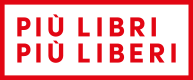

<!--
Kalender — redigera den här filen. Innehållet visas i appen under knappen "Kalender".

Format (Markdown):
- Rubriker: ## Rubrik   ### Underrubrik
- Listor: - punkt   eller   1. numrerad
- Fetstil: **text**    Kursiv: *text*
- Mässlänkar: [text](#fair-id)  — öppnar intern mässida (massor/id.md)
- Mässlogotyp: 
- Tabell: | kolumn | kolumn |
- Avskiljare: ---

Efter publicering: bumpa CACHE_NAME i sw.js så iPaderna hämtar den nya texten.
-->

Datum och plats uppdateras löpande.

| Mässa | Datum | Plats |
| --- | --- | --- |
|  | 4–8 december 2026 | Rom (La Nuvola) |
| [Bologna Children's Book Fair](#fair-bologna) | 5–8 april 2027 | Bologna |
|  | 13–17 maj 2027 | Turin (Lingotto Fiere) |
