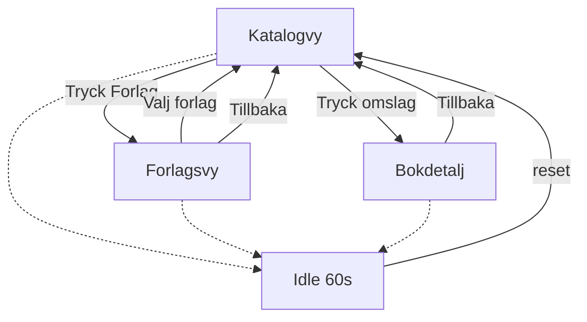

# UI-flöden

Tre vyer. Ett jobb per vy. Stora tryckytor. Optimerat för iPad-touch i kiosk.

Filterenheten är **förlag** (publishers), med logotyp + namn.

## Vy 1 — Katalog

**Syfte:** bläddra bland bokomslag.

- Grid eller horisontell/vertikal scroll med omslagsbilder.
- Tryck på omslag → öppna **bokdetalj**.
- Tydlig knapp/läge **Förlag** → öppna **förlagsvy**.
- Om filter är aktivt: visa endast det förlagets titlar + tydlig kontroll **Visa alla** / rensa filter (t.ex. chip med förlagsnamn).

## Vy 2 — Förlag

**Syfte:** välja förlag för att filtrera katalogen.

- Lista/grid med förlagslogotyp + namn.
- Tryck på förlag → tillbaka till katalog med `publisherId`-filter satt.
- Tillbaka utan nytt val behåller eventuellt befintligt filter.

## Vy 3 — Bokdetalj

**Syfte:** läsa kort info och ta med länken via QR.

- Omslag (stort), titel, `bookAuthor`, förlagsnamn, `summary`.
- QR-kod genererad från bokens `url`.
- Tillbaka till katalog (behåll aktivt förlagsfilter om sådant finns).

## Idle-reset (60 sekunder)

Efter 60 s utan `touchstart` / `pointerdown` / `keydown`:

1. Stäng bokdetalj.
2. Lämna förlagsvy.
3. Rensa `publisherId`-filter.
4. Visa katalogstart och scrolla till topp.

Nästa besökare ska alltid landa i samma nolläge.

## Interaktionsprinciper

- Få steg: katalog ↔ förlag ↔ detalj — inga djupa menyer.
- Inga små ikoner som enda kontroll; text + stor yta.
- Undvik overlays, badges och sekundärt brus i första vyn.
- Body är låst; scroll sker i inre containrar (se [arkitektur.md](arkitektur.md)).
